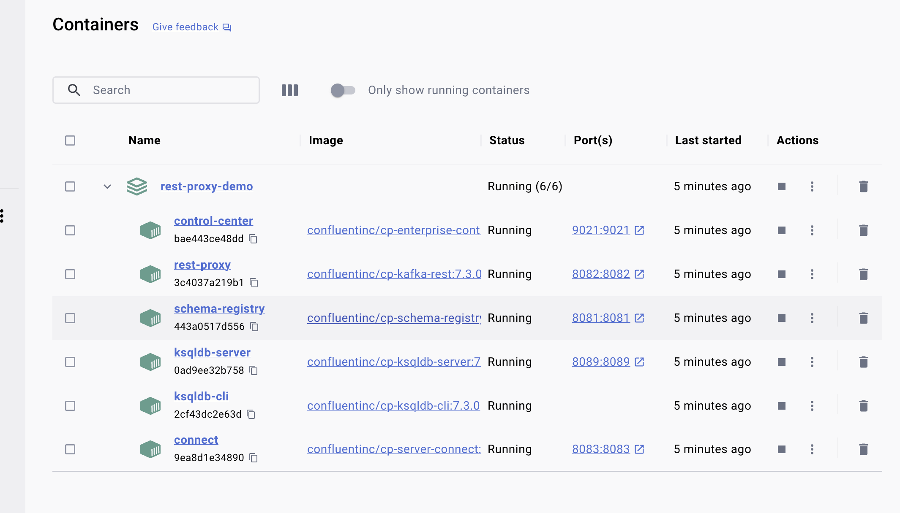
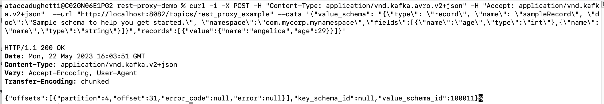
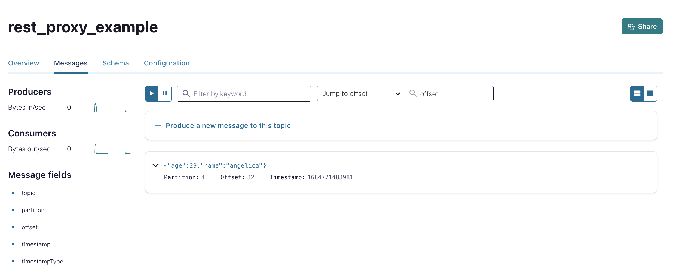
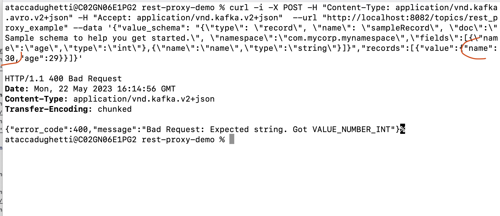
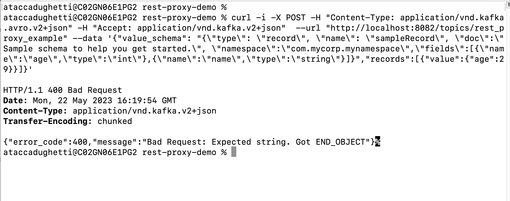
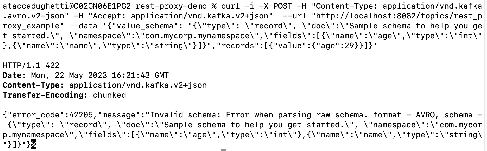

## Demo: Self-managed REST Proxy with Confluent Cloud
<br>
Let's try to host REST Proxy in localhost and make it work with CC.
<br>
# DISCLAIMER: THIS IS A SUPER SIMPLE EXAMPLE, not really useful for production etc. <br>

If you want a kubernetes example by Confluent <br>
https://github.com/confluentinc/confluent-kubernetes-examples/tree/master/hybrid/ccloud-integration
<br>
<br>
# Scenario: <br>
- hosting Confluent Platform in my local machine, with Docker. <br>
- Taking into advtange REST PROXY for sending messages to a topic in Confluent Cloud.
<br>

Good inspo from these links! <br>

https://www.confluent.io/es-es/blog/a-comprehensive-rest-proxy-for-kafka/ <br>
https://github.com/confluentinc/kafka-rest <br>
https://docs.confluent.io/platform/current/kafka-rest/api.html#rest-api-usage-examples <br>
<br>                    
<br>
## Detailed video of every step here:<br>
----> 

https://drive.google.com/file/d/1uh-MYKVAOFPCmMYWZnNLR3vbl6dsZeyX/view?usp=sharing

<br>

<br>
First clone the git repo, and enter in the folder:

```
git clone https://github.com/angietd94/confluent-cloud-rest-proxy.git
cd confluent-cloud-hybrid-demo

```

<br>

##  Second part: Setting up CP on localhost with Docker! (REST PROXY IS INCLUDED) <br>

Then change the values in config.sh depending on your own account. <br>
You can find the description on how to find all values in this repo: <br>
https://github.com/angietd94/confluent-cloud-hybrid-demo <br>
Where also it is explained how to launch the script in the "Second part: Launching the script! " but basically this is just to have CP running (AND THEN REST PROXY included).

That basically is summaryzing: <br>
```
chmod +x executable.sh 
chmod +x config_files.sh
chmod +x config.sh
chmod +x ccloud-generate-cp-configs.sh
./executable.sh
```
<br>


##  Create a topic and fill it with data!  <br>

<br>
- Let's create the topic (here rest_proxy_example, and put a simple schema AVRO, for example having a name and age of someone:
<br>

```
{
  "doc": "Sample schema to help you get started.",
  "fields": [
    {
      "name": "age",
      "type": "int"
    },
    {
      "doc": "The string is a unicode character sequence.",
      "name": "name",
      "type": "string"
    }
  ],
  "name": "sampleRecord",
  "namespace": "com.mycorp.mynamespace",
  "type": "record"
}
```

<br>

Is it all up and running in Docker? GOOD! <br>
<br>


<br>

Let's try some curl commands...

<br>
For example: <br>

```
curl http://localhost:8082/v3/clusters
curl http://localhost:8082/topics
curl http://localhost:8082/topics/rest_proxy_example | jq
```

A sample message that will work here: <br>

```
curl -i -X POST -H "Content-Type: application/vnd.kafka.avro.v2+json" -H "Accept: application/vnd.kafka.v2+json"  --url "http://localhost:8082/topics/rest_proxy_example" --data '{"value_schema": "{\"type\": \"record\", \"name\": \"sampleRecord\", \"doc\":\"Sample schema to help you get started.\", \"namespace\":\"com.mycorp.mynamespace\",\"fields\":[{\"name\":\"age\",\"type\":\"int\"},{\"name\":\"name\",\"type\":\"string\"}]}","records":[{"value":{"name":"angelica","age":29}}]}' 
```


If good it will give 200 OK<br>
<br>

<br> And in Confluent Cloud: <br>
<br>


<br>

## Errors examples
<br>
# EXAMPLE WRONG DATA: name field wrong in the schema <br>

```
curl -i -X POST -H "Content-Type: application/vnd.kafka.avro.v2+json" -H "Accept: application/vnd.kafka.v2+json"  --url "http://localhost:8082/topics/rest_proxy_example" --data '{"value_schema": "{\"type\": \"record\", \"name\": \"sampleRecord\", \"doc\":\"Sample schema to help you get started.\", \"namespace\":\"com.mycorp.mynamespace\",\"fields\":[{\"name\":\"age\",\"type\":\"int\"},{\"name\":\"nombre\",\"type\":\"string\"}]}","records":[{"value":{"name":"angelica","age":29}}]}' 
```

<br>
# EXAMPLE WRONG DATA: name field wrong in the schema AND in the data  <br>

```
curl -i -X POST -H "Content-Type: application/vnd.kafka.avro.v2+json" -H "Accept: application/vnd.kafka.v2+json"  --url "http://localhost:8082/topics/rest_proxy_example" --data '{"value_schema": "{\"type\": \"record\", \"name\": \"sampleRecord\", \"doc\":\"Sample schema to help you get started.\", \"namespace\":\"com.mycorp.mynamespace\",\"fields\":[{\"name\":\"age\",\"type\":\"int\"},{\"name\":\"nombre\",\"type\":\"string\"}]}","records":[{"value":{"nombre":"angelica","age":29}}]}' 
<br>
```


<br>

<br>
# Case: Name is an int and not a string

<br>

```
curl -i -X POST -H "Content-Type: application/vnd.kafka.avro.v2+json" -H "Accept: application/vnd.kafka.v2+json"  --url "http://localhost:8082/topics/rest_proxy_example" --data '{"value_schema": "{\"type\": \"record\", \"name\": \"sampleRecord\", \"doc\":\"Sample schema to help you get started.\", \"namespace\":\"com.mycorp.mynamespace\",\"fields\":[{\"name\":\"age\",\"type\":\"int\"},{\"name\":\"name\",\"type\":\"string\"}]}","records":[{"value":{"nombre":30,"age":29}}]}' 

```


OR if missing data...

```
curl -i -X POST -H "Content-Type: application/vnd.kafka.avro.v2+json" -H "Accept: application/vnd.kafka.v2+json"  --url "http://localhost:8082/topics/rest_proxy_example" --data '{"value_schema": "{\"type\": \"record\", \"name\": \"sampleRecord\", \"doc\":\"Sample schema to help you get started.\", \"namespace\":\"com.mycorp.mynamespace\",\"fields\":[{\"name\":\"age\",\"type\":\"int\"},{\"name\":\"name\",\"type\":\"string\"}]}","records":[{"value":{"age":29}}]}' 
```


<br>
<br>

<br>


Example: SampleRecord missing!

curl -i -X POST -H "Content-Type: application/vnd.kafka.avro.v2+json" -H "Accept: application/vnd.kafka.v2+json"  --url "http://localhost:8082/topics/rest_proxy_example" --data '{"value_schema": "{\"type\": \"record\", \"doc\":\"Sample schema to help you get started.\", \"namespace\":\"com.mycorp.mynamespace\",\"fields\":[{\"name\":\"age\",\"type\":\"int\"},{\"name\":\"name\",\"type\":\"string\"}]}","records":[{"value":{"age":29}}]}' 

<br>


## Examples with mock data

In the other parts of the video I basically just made ChatGPT make the work by creating some mock data similar to this. <br>
The first time is working fine and in the second you see some errors. Not really relevant just an example.
<br>

